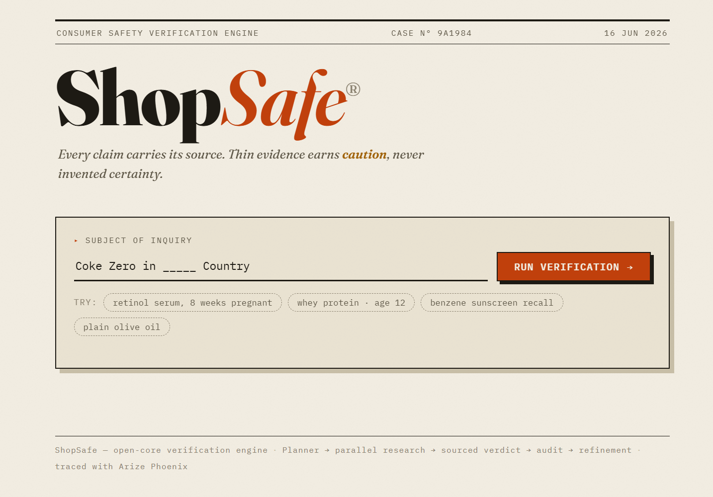
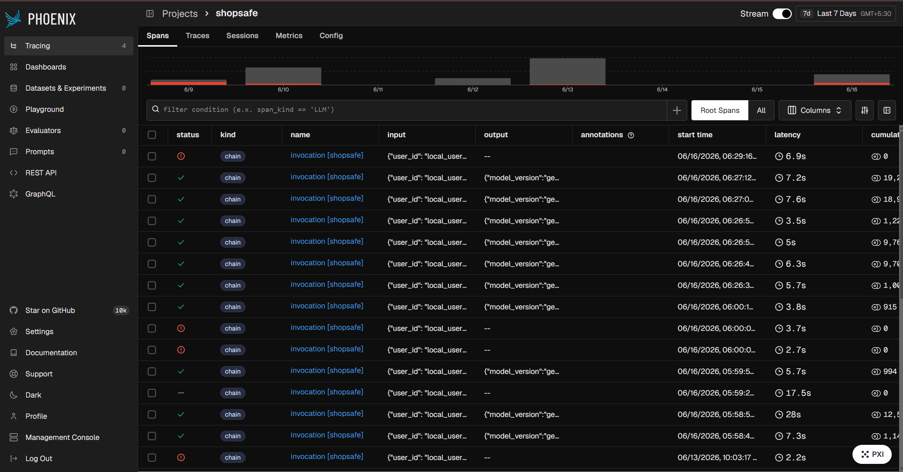

# ShopSafe

**A self-improving product-safety research agent.** Give it a buying intent in plain English, typos and context and all:

> Example: *"Planning to buy ____ supplement. in ____ country"*

It plans targeted research queries, searches the live web in parallel, and writes a structured **safe / caution / avoid** verdict where every claim carries a source URL. It then audits its own answer with an LLM judge, and when the audit fails it re-plans, re-searches, and rewrites. Across runs, it mines its own traces in [Arize Phoenix](https://phoenix.arize.com/) to learn a better search playbook.



Built solo with:
- Google ADK for agent orchestration and structured LLM output
- Gemini and Groq for all LLM stages (planner, verdict writer, judge)
- Exa for web search (with highlights, domain filters, and category guards)
- Arize AI's Phoenix for tracing, observability, and the improver loop (MCP toolset)

---

### Demo Video

Prefer to watch? Here's the ~60-second version -

[](https://youtu.be/k8uwFcPjTQQ)

Direct link: https://youtu.be/k8uwFcPjTQQ


## Why this is interesting

Most "safety checker" demos are a single prompt with a search tool bolted on. ShopSafe is a **pipeline with an immune system**:

- **Trust layer as a product requirement.** The agent never makes direct medical claims. It says "X is classified as a carcinogen by the WHO, per this URL" rather than "X causes cancer". Thin or conflicting evidence is *required* to produce `caution` plus a stated reason, never invented certainty. A deterministic **evidence floor** downgrades any uncited "safe" rating to "caution" before the judge ever sees it.
- **LLM-as-judge with a deterministic gate.** A separate auditor scores groundedness, source authority, and tone safety. The pipeline does not trust the judge's own `is_approved` flag. It applies a hard rule (`min(scores) >= 0.85`) because models frequently contradict their own scores.
- **Critique-driven refinement that actually re-grounds.** A rejected verdict feeds the critique back to the planner, which emits **new** queries (duplicates forbidden), growing the evidence pool before the rewrite. The best verdict across all passes wins, so refinement can never regress the answer.
- **Cross-run self-improvement.** An offline improver agent connects to Phoenix via **MCP**, reads the project's own low-scoring traces, clusters failure patterns, and writes a search **playbook** that the planner loads on every future run.
- **Everything is observable.** OpenInference auto-instrumentation traces every LLM call and tool span to Phoenix. Audit scores are attached to spans as annotations, so eval quality is queryable, which is what makes the improver loop possible.


*Every run lands in Phoenix as a trace tree — planner, parallel searches, verdict, and judge spans — with audit scores attached as annotations. That queryable eval history is exactly what the improver loop mines.*

## Architecture

```
raw user query  (free-text buying intent plus any health context)
   │
   ▼
[1] PLANNER      LLM -> ResearchPlan: product, ingredients, user_context,
   │             3 targeted queries (ingredient studies / recalls / authority-scoped)
   │             plus learned playbook.md appended to its instruction, if present
   ▼
[2] RESEARCHER   deterministic, NOT an LLM: asyncio.gather over planned queries ->
   │             Exa search_and_contents (highlights on) -> one shared evidence pool;
   │             every search logged to session history (the judge sees everything)
   ▼
[3] VERDICT      LLM -> SafetyVerdict: per-ingredient safe/caution/avoid, every claim
   │             cites a URL *from the evidence pool*, user context addressed
   │             -> deterministic evidence-floor downgrade (uncited "safe" -> "caution")
   ▼
[4] AUDITOR      LLM judge -> AuditVerdict: groundedness / authority / tone scores
   │             gate: ALL three scores >= 0.85 (deterministic, is_approved ignored)
   ▼
[5] LOOP         while rejected and passes remain:
                 critique -> PLANNER again (sees prior queries, emits NEW ones only)
                 -> new evidence appended -> VERDICT rewrite -> re-audit
                 -> best verdict across passes is returned

────────────────────────────  offline, cross-run  ────────────────────────────

[6] IMPROVER     ADK agent + Phoenix MCP toolset -> reads its own traces and
                 low-scoring audit annotations -> clusters failures -> writes
                 agent/shopsafe/playbook.md -> planner loads it next run
```

A key ADK constraint this design respects: an ADK `Agent` can have **tools or `output_schema`, never both** (setting both silently disables tool-calling). Here research is deterministic, so no LLM stage needs tools, and every LLM stage gets safe structured output through one wrapper (`agent/shopsafe/llm.py`) that routes to Gemini (ADK plus `output_schema`) or Groq (JSON mode), switchable by env var.


### Web UI: live pipeline theater

```bash
uv run python web/server.py
# open http://localhost:8000
```

Type a query and watch the pipeline run live: planning, parallel searches, verdict, audit scores, refinement pass, streamed stage by stage, ending in a fully sourced verdict card.

### CLI

```bash
uv run python agent/main.py "thinking of taking a collagen supplement while pregnant"
```

Sample (abridged) output:

```
  [PASS 1] PLANNING
  Product:     Collagen peptide supplement
  User ctx:    user is pregnant
  Queries (3):
    - collagen supplement safety pregnancy [ods.od.nih.gov, nih.gov, fda.gov]
      -> Authority-scoped review of supplement safety during pregnancy
    - collagen peptide supplement recall contamination    (news)
      -> Surface recalls or contamination warnings
    ...

  PASS 1 AUDIT
  Groundedness:  0.95 | Authority: 0.90 | Tone Safety: 1.00 - APPROVED

  FINAL SAFETY REPORT
  Overall Rating: CAUTION
  User Context:   Safety data for supplementation during pregnancy is limited;
                  consult a clinician before use (cited).
    [CAUTION] Collagen peptides
           - NIH ODS notes supplement safety data in pregnancy is limited
             https://ods.od.nih.gov/...
```

## The self-improvement loop

```bash
# 1. Baseline: run the benchmark
uv run python evals/harness.py

# 2. Run the improver. It reads Phoenix traces via MCP and rewrites the playbook
uv run python agent/improver.py

# 3. Inspect what it learned
git diff agent/shopsafe/playbook.md

# 4. Re-run the benchmark. The planner now follows the learned rules
uv run python evals/harness.py
```

The improver is an ADK agent wired with `McpToolset` running `@arizeai/phoenix-mcp`. It queries the `shopsafe` project for runs whose audit annotations score below 0.85, clusters the failure modes (weak authority domains, thin citations, dropped user context, alarmist phrasing), and emits `agent/shopsafe/playbook.md`. The planner appends that playbook to its instruction on every run, so mistakes observed in production traces become rules the agent follows tomorrow.

## Evals

A 10-case benchmark (`evals/cases.py`) covers the failure modes that matter for a safety product: child plus supplement, pregnancy plus retinol, known recalls (recalled weight-loss supplements, benzene-contaminated sunscreens), obscure ingredients that must produce *honest uncertainty*, genuinely safe products that must **not** be fear-mongered, heavy typos, allergy context, and multi-product queries. Each case asserts declarative checks against the structured `PipelineResult` (context extracted? verdict in allowed set? minimum citations?), and the harness prints a per-dimension audit-score table:

```bash
uv run python evals/harness.py            # full run
uv run python evals/harness.py --limit 3  # cheap smoke run
```

## Quickstart

**Prereqs:** Python 3.10 to 3.12, [uv](https://docs.astral.sh/uv/), a Gemini key (or Vertex), an [Exa](https://dashboard.exa.ai) key, and (optional but recommended) a [Phoenix Cloud](https://app.phoenix.arize.com) key for tracing.

```bash
git clone <this repo> && cd shopsafe
cp .env.example .env        # fill in GOOGLE_API_KEY, EXA_API_KEY, PHOENIX_* keys
uv sync
uv run python agent/main.py "retinol serum, 8 weeks pregnant"
```

Then open Phoenix, go to project `shopsafe`, and look at the trace tree: planner LLM span, parallel `search` tool spans, verdict LLM span, judge LLM span, with audit scores annotated on the run.

### Configuration

Everything is env-driven through `agent/shopsafe/config.py` (no scattered `os.environ` reads):

| Variable | Default | Purpose |
|---|---|---|
| `GEMINI_MODEL` | `gemini-2.5-flash` | Default model for all stages |
| `PLANNER_MODEL` / `VERDICT_MODEL` / `JUDGE_MODEL` | `GEMINI_MODEL` | Per-stage overrides |
| `USE_GROQ=1` + `GROQ_API_KEY` | off | Route all LLM calls to Groq (JSON mode), handy to dodge Gemini rate limits during dev |
| `MAX_REFINEMENT_PASSES` | `2` | 2 means one critique-driven retry |
| `MAX_PLANNED_QUERIES` | `3` | Queries per planning pass |
| `EXA_NUM_RESULTS` / `EXA_SNIPPET_CHARS` | `5` / `800` | Evidence pool sizing |
| `AUDIT_PASS_THRESHOLD` | `0.85` | The deterministic audit gate |

## Project layout

| Path | Purpose |
|---|---|
| `agent/shopsafe/pipeline.py` | The orchestrator: plan, research, verdict, audit, loop |
| `agent/shopsafe/llm.py` | One structured-output wrapper for every LLM stage (Gemini/Groq) |
| `agent/shopsafe/models.py` | Pydantic schemas: `ResearchPlan`, `SafetyVerdict`, `AuditVerdict` |
| `agent/shopsafe/prompt.py` | Stage instructions (planner / verdict-writer / judge / improver) |
| `agent/shopsafe/judge.py` | Groundedness audit over the full session search history |
| `agent/shopsafe/tools/search.py` | Exa search tool (highlights, domain filters, category guard) |
| `agent/shopsafe/session.py` | ContextVar-based per-run session state (search history, verdicts) |
| `agent/shopsafe/playbook.md` | Learned search rules, written by the improver, read by the planner |
| `agent/improver.py` | Self-improvement agent (Phoenix MCP toolset) |
| `agent/instrumentation.py` | `phoenix.otel.register(auto_instrument=True)`, the tracing core |
| `agent/main.py` | One-shot CLI entrypoint |
| `web/` | FastAPI server plus live pipeline UI |
| `evals/` | Benchmark cases plus harness |

## Design decisions

- **Deterministic where determinism wins.** Research execution, the audit gate, the evidence floor, and best-verdict selection are plain Python. LLMs only do the jobs that need judgment (planning, writing, scoring). Fewer failure modes, easier tests.
- **One LLM wrapper, plug-and-play providers.** `generate_structured(schema=...)` is the only way any stage calls a model. Swapping Gemini and Groq is one env var; new providers are one function.
- **Schema validators as guardrails.** The planner sometimes invents Exa categories that crash the API (`"guideline"`); a `field_validator` coerces off-list categories to `None` before they reach the search client.

## Future work

Engine-level next steps, in rough priority order. The theme is the same one that runs through the whole project: **make the self-improvement loop trustworthy enough to leave running unattended.**

- **A seatbelt on the improver.** Today the improver rewrites `playbook.md` and the next run trusts it blindly — but a bad rule degrades *every* future run. The fix: run the eval harness automatically after each improver pass and **auto-revert the playbook if audit scores drop.** That turns open-loop self-modification into self-improvement *with* a safety check.
- **Versioned playbooks.** The improver currently overwrites `playbook.md` in place. Keeping dated versions would let the harness answer the real question — does learning *accumulate*, or just *oscillate* between failure modes run to run?
- **Audit the improver's own output.** The pipeline's verdicts get judged; the improver's playbook edits don't. Scoring proposed rules before they land (clear / grounded / non-contradictory) applies the project's own "don't trust a model's unjudged output" principle to the learner itself.
- **Per-run cost budget.** Live evals plus two refinement passes (3 queries each) plus judge calls add up. A token/cost counter on `PipelineResult` would make the quality-vs-spend trade-off visible and enforceable per run.
- **More providers through the one wrapper.** `generate_structured(schema=...)` is the single seam every stage calls a model through, so adding a provider is one function and no pipeline changes — worth doing to de-risk any single vendor's rate limits.

> This repo is the open-core verification *engine*. The product's commercial layer (label-photo input, personalized memory, alternative-product recommendations) lives in a separate private repo and is intentionally not part of this roadmap.