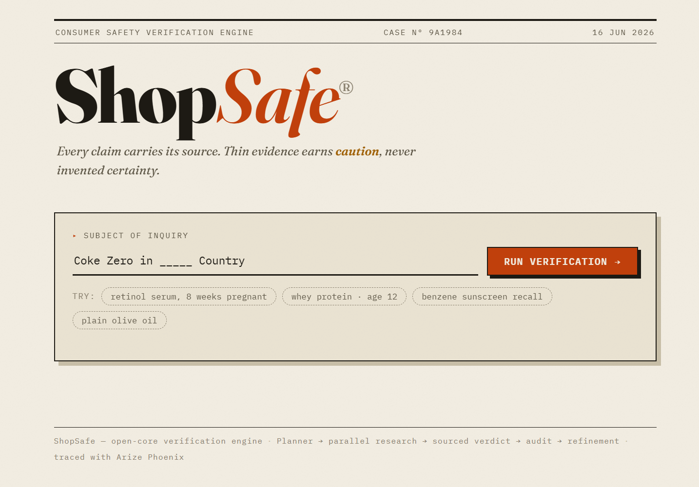
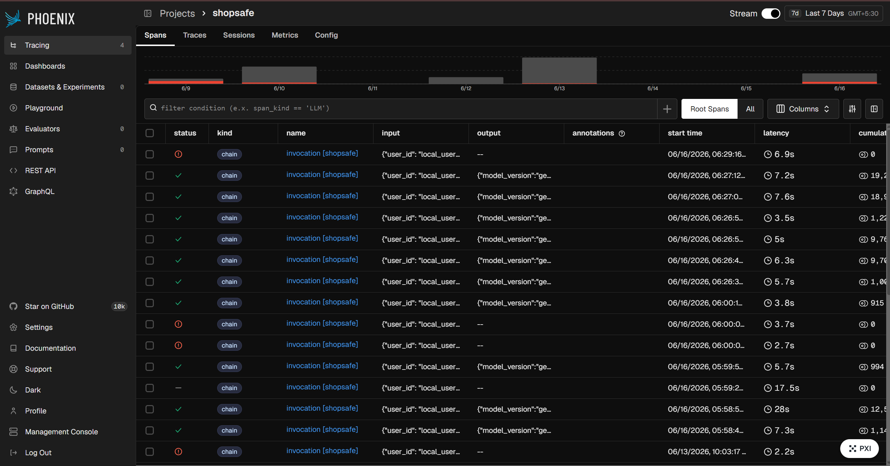

# ShopSafe

**Do the homework before you buy the thing. No lab coat required.**

ShopSafe is a product-safety research agent. Tell it what you are thinking of buying, including details that matter to you, such as pregnancy, an allergy, or a child's age. It plans web searches, gathers sources, and returns a structured **safe / caution / avoid** assessment. An LLM auditor checks the answer; if a score is low, the agent searches again and revises it.

The assessment is a starting point for research, not a medical diagnosis or a guarantee that a product is safe. Read the cited sources and ask a qualified professional when the decision affects your health.



[Watch the demo](https://youtu.be/k8uwFcPjTQQ).

## Run it locally

You need Python **3.10–3.12**, [uv](https://docs.astral.sh/uv/), a [Gemini API key](https://aistudio.google.com/apikey), and an [Exa API key](https://dashboard.exa.ai). ShopSafe uses live web search, so a run needs internet access and may use your providers' API quotas.

```bash
git clone https://github.com/PyromancerBoom/product-safety-agent.git
cd product-safety-agent
cp .env.example .env
# Put your GOOGLE_API_KEY and EXA_API_KEY in .env.
uv sync --locked
uv run python agent/main.py "retinol serum, 8 weeks pregnant"
```

In PowerShell, use `Copy-Item .env.example .env` in place of `cp`. The example environment file selects the Gemini API key path by default. For Vertex AI instead, follow the commented alternative in [.env.example](.env.example).

For the browser UI, run `uv run python web/server.py` and open [http://localhost:8000](http://localhost:8000). It streams the planner, searches, verdict, and audit as they happen.

Phoenix tracing is optional for ordinary runs. To see traces, add `PHOENIX_API_KEY` and your Phoenix space's `PHOENIX_COLLECTOR_ENDPOINT` to `.env`, then look for project `shopsafe` in [Phoenix](https://app.phoenix.arize.com). The endpoint is the space URL shown in Phoenix settings, such as `https://app.phoenix.arize.com/s/your-space`; do not add `/v1/traces`.

## How a run works

1. **Planner:** A Gemini or Groq model turns your request into a product name, relevant ingredients and context. By default, it is asked for three targeted search queries.
2. **Researcher:** Python runs the planned [Exa](https://exa.ai) searches in parallel. Search results form one evidence pool, which grows if the agent makes another pass.
3. **Verdict writer:** The model assigns `safe`, `caution`, or `avoid` to each ingredient and writes claims with source URLs. The prompt asks it to use URLs from the evidence pool. A deterministic rule downgrades any ingredient marked `safe` with *no cited claims* to `caution`.
4. **Auditor:** A separate model scores groundedness, source authority, and tone safety. The pipeline accepts a pass only when **all three scores are at least 0.85**. The scores are model judgments, not independent fact checks.
5. **Refinement:** If a score misses the threshold, the planner receives the critique and previous queries, then is asked for fresh searches. The pipeline returns the passing candidate with the highest average score, or the highest-scoring candidate if none pass. An audit score is a useful signal, not proof that an answer improved.

The planner, verdict writer, and auditor use structured output through `agent/shopsafe/llm.py`. The live pipeline can use Gemini or Groq; the separate improver currently uses Gemini. Search execution, the citation floor, and the audit threshold are ordinary Python rules.

## Tracing and the learning loop

ShopSafe uses [Arize Phoenix](https://phoenix.arize.com/) and OpenInference to trace LLM calls and search spans when Phoenix is configured. It also tries to attach audit scores to the active span. Tracing and annotation failures do not stop the assessment, so confirm the scores in Phoenix before relying on them for analysis.



*This screenshot shows the Phoenix spans list. Open a run in Phoenix to inspect its trace tree and any audit annotations.*

An **offline improver** can read low-scoring traces through the Phoenix MCP server and rewrite [the search playbook](agent/shopsafe/playbook.md). The planner loads that file on later runs. This is an opt-in step: the improver changes a tracked file, and its proposed rules are not automatically checked against the benchmark.

```bash
# Requires Phoenix credentials in .env and Node.js/npx for the MCP server.
uv run python evals/harness.py --limit 3
uv run python agent/improver.py
git diff -- agent/shopsafe/playbook.md
uv run python evals/harness.py --limit 3
```

Review the diff and benchmark results before keeping a generated playbook. The repo's `.mcp.json` and `.gemini/settings.json` only provide an optional Phoenix **docs** server; `agent/improver.py` starts its own Phoenix **data** MCP connection using your `.env` values.

## Evals

The ten live cases in `evals/cases.py` cover pregnancy, children, allergies, recalls, thin evidence, typos, and multiple products. The harness checks properties of each structured result, such as expected context, allowed verdicts, and minimum citation counts. It prints the audit scores too. These checks catch some failures, but they do not certify medical accuracy.

```bash
uv run python evals/harness.py            # all 10 cases
uv run python evals/harness.py --limit 3  # shorter, lower-cost check
```

Each case calls the model and Exa, so the suite needs the same keys as a normal run and may incur API usage.

## Configuration

Set variables in `.env`; [.env.example](.env.example) contains the full setup notes.

| Variable | Default | What it controls |
| --- | --- | --- |
| `GOOGLE_API_KEY`, `EXA_API_KEY` | none | Required Gemini API key and live search key for the default setup. |
| `GOOGLE_GENAI_USE_VERTEXAI`, `GOOGLE_CLOUD_PROJECT`, `GOOGLE_CLOUD_LOCATION` | off | Alternative Vertex AI authentication; see `.env.example`. |
| `PHOENIX_API_KEY`, `PHOENIX_COLLECTOR_ENDPOINT` | unset | Optional tracing; required for the offline improver. |
| `GEMINI_MODEL` | `gemini-2.5-flash` | Default Gemini model. |
| `PLANNER_MODEL`, `VERDICT_MODEL`, `JUDGE_MODEL` | `GEMINI_MODEL` | Per-stage Gemini model overrides. |
| `USE_GROQ=1`, `GROQ_API_KEY`, `GROQ_MODEL` | off, unset, `llama-3.3-70b-versatile` | Route the live pipeline through Groq instead of Gemini. |
| `MAX_REFINEMENT_PASSES`, `MAX_PLANNED_QUERIES` | `2`, `3` | Total attempts and queries requested per attempt. |
| `EXA_NUM_RESULTS`, `EXA_SNIPPET_CHARS` | `5`, `800` | Search results per query and snippet length. |
| `AUDIT_PASS_THRESHOLD` | `0.85` | Minimum score for each audit dimension. |

## Where to look

- `agent/shopsafe/pipeline.py` runs the plan → research → verdict → audit loop.
- `agent/shopsafe/models.py` defines the structured plans, claims, verdicts, and scores.
- `agent/shopsafe/tools/search.py` calls Exa; `agent/shopsafe/llm.py` calls Gemini or Groq.
- `agent/main.py` is the CLI; `web/server.py` serves the live UI.
- `agent/improver.py` updates the playbook; `evals/harness.py` runs the live benchmark.

## Status and credits

The next useful safeguard is to run the benchmark automatically after a playbook edit and reject edits that lower its scores. That check is not in place yet.

Built solo for the **Google Rapid Agents Hackathon**, starting from [Arize AI](https://arize.com/)'s ADK + Phoenix agent starter template. ShopSafe uses Google ADK, Gemini or Groq, Exa, and Arize Phoenix. This repository contains the research engine and demo UI; the separate commercial product is outside its scope.

Licensed under [Apache 2.0](LICENSE).
