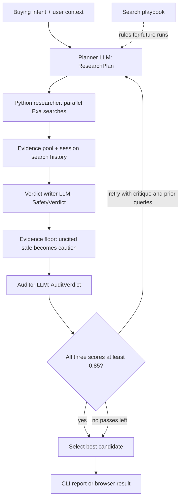
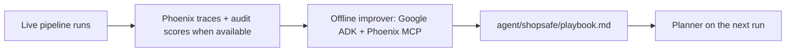

# ShopSafe

**Do the homework before you buy the thing. No lab coat required.**

ShopSafe researches product and ingredient safety before you buy. Tell it what you want to buy and include details that matter, such as pregnancy, an allergy, a child's age, or your country. ShopSafe plans live web searches, gathers sources, and writes a structured **safe / caution / avoid** assessment. A separate large language model (LLM) audits the answer. If any score falls short, ShopSafe searches again and rewrites the assessment.

Use the assessment as a starting point for research, not as a medical diagnosis or a guarantee of safety. Read the cited sources and ask a qualified professional when the decision affects your health.


[Watch the demo](https://youtu.be/k8uwFcPjTQQ).

## Run it locally

Install Python **3.10–3.12** and [uv](https://docs.astral.sh/uv/). Get a [Gemini API key](https://aistudio.google.com/apikey) and an [Exa API key](https://dashboard.exa.ai). Each run searches the live web and calls a model, so you need internet access and may use your providers' API quotas.

```bash
git clone https://github.com/PyromancerBoom/product-safety-agent.git
cd product-safety-agent
cp .env.example .env
# Put your GOOGLE_API_KEY and EXA_API_KEY in .env.
uv sync --locked
uv run python agent/main.py "retinol serum, 8 weeks pregnant"
```

In PowerShell, replace `cp` with `Copy-Item .env.example .env`. The example file starts with the Gemini API key path. To use Vertex AI instead, follow the commented steps in [.env.example](.env.example).

Want to watch a run in the browser? Start `uv run python web/server.py` and open [http://localhost:8000](http://localhost:8000). The FastAPI server sends planning, search, verdict, and audit events to the page through Server-Sent Events (SSE).

You can run the CLI or UI without Phoenix. To collect traces, add `PHOENIX_API_KEY` and your space's `PHOENIX_COLLECTOR_ENDPOINT` to `.env`, then open project `shopsafe` in [Phoenix](https://app.phoenix.arize.com). Copy the space URL from Phoenix settings, such as `https://app.phoenix.arize.com/s/your-space`; leave off `/v1/traces`.

## Technical design


```mermaid
flowchart TD
    Q["Buying intent + user context"] --> P["Planner LLM: ResearchPlan"]
    PB["Search playbook"] -. "rules for future runs" .-> P
    P --> R["Python researcher: parallel Exa searches"]
    R --> E["Evidence pool + session search history"]
    E --> V["Verdict writer LLM: SafetyVerdict"]
    V --> F["Evidence floor: uncited safe becomes caution"]
    F --> A["Auditor LLM: AuditVerdict"]
    A --> G{"All three scores at least 0.85?"}
    G -->|yes| B["Select best candidate"]
    G -->|retry with critique and prior queries| P
    G -->|no passes left| B
    B --> O["CLI report or browser result"]
```

The pipeline keeps each run's verdicts and search history in a `ContextVar` session. That lets the auditor compare a verdict with every search result from the same run, including earlier passes. The browser server streams stage events through SSE; the CLI prints the final report and audit scores.

### What each stage does

1. **Planner:** A Gemini or Groq model extracts the product name, ingredients, and user context from your request. ShopSafe asks it for three targeted search queries by default.
2. **Researcher:** Python runs the planned [Exa](https://exa.ai) searches in parallel with `asyncio.gather`. Each result includes a title, URL, date, and snippet. The planner can restrict searches to specific domains or request an Exa category; a validator drops categories Exa does not accept. ShopSafe adds results from later passes to the same evidence pool.
3. **Verdict writer:** The model assigns `safe`, `caution`, or `avoid` to each ingredient and writes claims with source URLs. Its prompt asks it to use only URLs from the evidence pool. Python then changes any ingredient marked `safe` with *no cited claims* to `caution`. The code does not independently verify that each URL supports its claim.
4. **Auditor:** A separate model reads the verdict and full search history, then scores groundedness, source authority, and tone safety. Python accepts a pass only when **all three scores reach 0.85**; it does not rely on the model's `is_approved` flag. The scores reflect model judgment, not an independent fact check.
5. **Refinement:** If a score misses the threshold, ShopSafe sends the critique and previous queries back to the planner and asks for new searches. It allows two passes by default. When the loop stops, Python chooses the passing candidate with the highest average score, or the highest-scoring candidate if none passed. A higher audit score does not prove better medical accuracy.

The planner, verdict writer, and auditor share `agent/shopsafe/llm.py`. Pydantic models define the fields each stage must return, and the wrapper validates those fields. The live pipeline runs these stages with Gemini through Google's Agent Development Kit (ADK) or with Groq through JSON mode. Python runs the Exa searches, so those LLM stages can return structured output without calling a tool themselves. The separate improver uses an ADK agent with a Model Context Protocol (MCP) toolset and currently runs on Gemini.

## Tracing and the learning loop

When you configure [Arize Phoenix](https://phoenix.arize.com/), OpenInference traces LLM calls and search spans. ShopSafe also attempts to attach audit scores to the active span as Phoenix annotations. A tracing or annotation failure does not stop the run; check Phoenix before using its scores for analysis.


*Phoenix lists the spans from ShopSafe runs. Open a run to inspect its trace tree and any audit annotations; this screenshot does not show those annotations.*

The **offline improver** closes the loop across runs:


```mermaid
flowchart LR
    R["Live pipeline runs"] --> T["Phoenix traces + audit scores when available"]
    T --> I["Offline improver: Google ADK + Phoenix MCP"]
    I --> P["agent/shopsafe/playbook.md"]
    P --> N["Planner on the next run"]
```

Run the improver when you want it to inspect low-scoring traces and rewrite [the search playbook](agent/shopsafe/playbook.md). The planner reads that file on each new run. The improver changes a tracked file, but it does not run the benchmark or reject a weak playbook for you.

```bash
# First add Phoenix credentials to .env and install Node.js/npx for the MCP server.
uv run python evals/harness.py --limit 3
uv run python agent/improver.py
git diff -- agent/shopsafe/playbook.md
uv run python evals/harness.py --limit 3
```

Compare the before-and-after benchmark results and review the playbook diff before you keep an improver change. The repo's `.mcp.json` and `.gemini/settings.json` configure an optional Phoenix **docs** server. `agent/improver.py` starts its own Phoenix **data** MCP connection with your `.env` values.

## Evals

`evals/cases.py` supplies ten live cases covering pregnancy, children, allergies, recalls, thin evidence, typos, and multiple products. The harness checks each structured result for expected context, allowed verdicts, and minimum citation counts, then prints the audit scores. These checks catch some failures; they do not certify medical accuracy.

```bash
uv run python evals/harness.py            # all 10 cases
uv run python evals/harness.py --limit 3  # shorter, lower-cost check
```

Each case calls a model and Exa. Give the harness the same keys as a normal run, and expect API usage.

## Configuration

Set these variables in `.env`. [.env.example](.env.example) shows the setup steps and optional overrides.

| Variable | Default | What it controls |
| --- | --- | --- |
| `GOOGLE_API_KEY`, `EXA_API_KEY` | none | Required Gemini API key and live search key for the default setup. |
| `GOOGLE_GENAI_USE_VERTEXAI`, `GOOGLE_CLOUD_PROJECT`, `GOOGLE_CLOUD_LOCATION` | off | Alternative Vertex AI authentication; see `.env.example`. |
| `PHOENIX_API_KEY`, `PHOENIX_COLLECTOR_ENDPOINT` | unset | Optional tracing; required for the offline improver. |
| `GEMINI_MODEL` | `gemini-2.5-flash` | Default Gemini model. |
| `PLANNER_MODEL`, `VERDICT_MODEL`, `JUDGE_MODEL` | `GEMINI_MODEL` | Per-stage Gemini model overrides. |
| `USE_GROQ=1`, `GROQ_API_KEY`, `GROQ_MODEL` | off, unset, `llama-3.3-70b-versatile` | Route the live pipeline through Groq instead of Gemini. |
| `MAX_REFINEMENT_PASSES`, `MAX_PLANNED_QUERIES` | `2`, `3` | Total attempts and queries requested per attempt. |
| `EXA_NUM_RESULTS`, `EXA_SNIPPET_CHARS` | `5`, `800` | Search results per query and snippet length. |
| `AUDIT_PASS_THRESHOLD` | `0.85` | Minimum score for each audit dimension. |

## Where to look

- `agent/shopsafe/pipeline.py` runs the plan → research → verdict → audit loop.
- `agent/shopsafe/models.py` defines the structured plans, claims, verdicts, and scores.
- `agent/shopsafe/tools/search.py` calls Exa; `agent/shopsafe/llm.py` calls Gemini or Groq.
- `agent/main.py` is the CLI; `web/server.py` serves the live UI.
- `agent/improver.py` updates the playbook; `evals/harness.py` runs the live benchmark.

## Status and credits

ShopSafe does not yet test an improver edit before loading it on the next run. The next safeguard should run the benchmark after each edit and reject playbooks that lower its scores.

I built ShopSafe solo for the **Google Rapid Agents Hackathon**, starting from [Arize AI](https://arize.com/)'s ADK + Phoenix agent starter template. ShopSafe uses Google ADK, Gemini or Groq, Exa, and Arize Phoenix. This repository contains the research engine and demo UI. I keep the separate commercial product outside this repo.

Licensed under [Apache 2.0](LICENSE).
